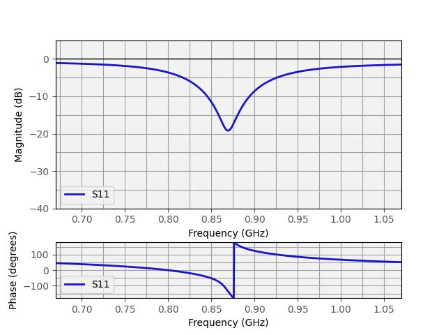
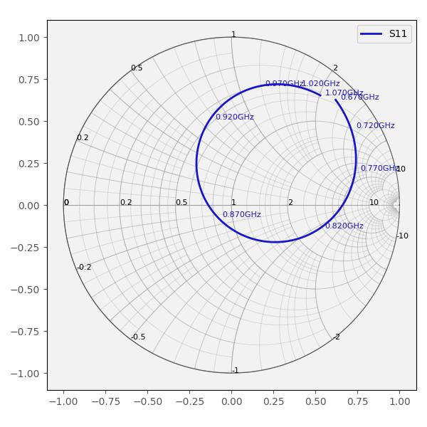
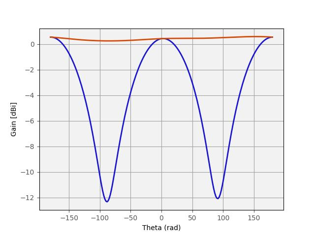
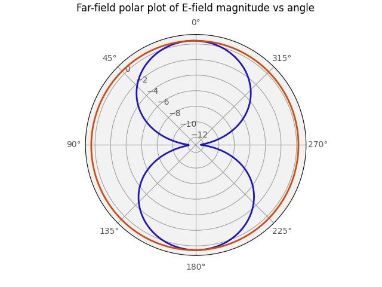

# LoRa GPS IoT — PCB Proof-of-Concept

This repository hosts the LoRa GPS IoT proof-of-concept developed as the final project of the High Frequency Circuit Design course at ECAM.
The system integrates a GPS receiver, an ESP32 microcontroller, and a LoRa transceiver to provide location reporting over the LoRaWAN 868 MHz band.
A dedicated custom PCB antenna was designed, simulated and produced for LoRa operation at 868 MHz 
The design was specified in collaboration with an industrial partner and implemented on a 2‑layer FR4 PCB.
Every tool used during this project was open-source.

All KiCad & gerber files are available in the [hardware](/hardware) directory.

Antenna simulation can be found in [software](/software).

## Specifications

- Provide GPS-based localization transmission over LoRa at the 868 MHz European LoRa frequency band.
- Support Wi-Fi/BLE communication with ESP32 provided antenna.
- Support multiple power inputs: USB‑C, external battery (2S), and solar panel input.
- Create a compact PCB (≤ 10×10 cm for fabrication on JLCPCB) as a proof of concept.
- Create a custom Inverted‑F Antenna (IFA) tuned to 868 MHz.

## Hardware used

- **ESP32‑C3‑WROOM‑02** — main MCU (USB‑C programming and Wi‑Fi/BLE). Supports SPI and I²C for peripheral interfaces.
- **RFM95 (LoRa) module** — 868 MHz LoRa transceiver (module used without on‑board antenna; external/custom antenna on separate antenna PCB).
- **GPS module AM‑M8Q‑0** — GNSS receiver for latitude/longitude acquisition.
- **BQ25798** — battery charger/power manager supporting USB‑C and solar inputs, designed for a 2S battery configuration.
- **USB‑C connector** — for programming and charging.
- **SMA connector** — RF connector for the custom antenna / external antenna.

## Antenna simulation & testing
### Simulation

Electromagnetic simulations were performed using the Emerge Python‑based EM tool to optimize the antenna geometry for maximum radiated power and minimal reflection at the target frequency.

 | 
:------------:|:--------------------------:
S11 reflection coefficient | Smith chart of reflection coefficient

Primary performance metrics from simulation:
- Minimum simulated **S₁₁ = −17.75 dB at 868 MHz**.
- **−10 dB impedance bandwidth ≈ 50 MHz**, which covers the LoRaWAN band with margin for manufacturing tolerances.

The simulated Smith chart shows the antenna impedance close to the center (near 50 Ω) at 868 MHz; minor adjustments were left open to address real‑world feed/feedline/environment effects.

 | 
:-----------:|:-------------------:
Far-Field E  |  Polar Far-Field E

Far‑field results (normalized E‑field, polar plots and 3D radiation pattern) were generated to verify radiation behaviour

### Hardware validation

The manufactured IFA PCB was integrated into the system and validated using a Digital Spectrum Analyzer (DSA) by observing a distinct spectral peak at 868 MHz aligned with the transmission cadence when our custom antenna is sending its packet to a reference antenna tuned to the same band.

 | 
:-------------------------------------------------:|:---------------------------------------------:
Spectrum analysis without custom antenna emission  | Spectrum analysis with custom antenna emission 

Results confirm that the antenna radiates at the intended operating frequency.
Minor nearby spectral peaks were attributed to ambient RF activity.

Limitations: a Vector Network Analyzer (VNA) was not available during testing, preventing direct measurement of the antenna reflection coefficient (S₁₁) on the manufactured part.
This measurement is recommended for a definitive comparison against simulation.

## Improvements

Several enhancements could be considered to further improve the system’s performance 
and quality: 
- As the PCB was intentionally designed with only 2 layers and no ground/power 
planes to observe and measure EMI, but has finally not been done, upgrading our 
design to 4 layers with copper planes would simplify the PCB layout and improve 
EMC. It would, consequently, allow for a more compact design, making it more 
practical.
- Testing our system to EMI interferences would allow to have a better knowledge of 
its real-world performance, as well as its capability to respect HF regulations, a 
mandatory step to deliver our product to the market. 
- Access to a Vector Network Analyzer (or even a LiteVNA) would enable precise 
measurements of the antenna reflection coefficient and matching impedance, 
allowing direct comparison with simulation results and more accurate impedance 
tuning. 
- Testing the system in a real-world environment would provide more information on 
its robustness, in particular, packet loss and communication range and 
performance. 
